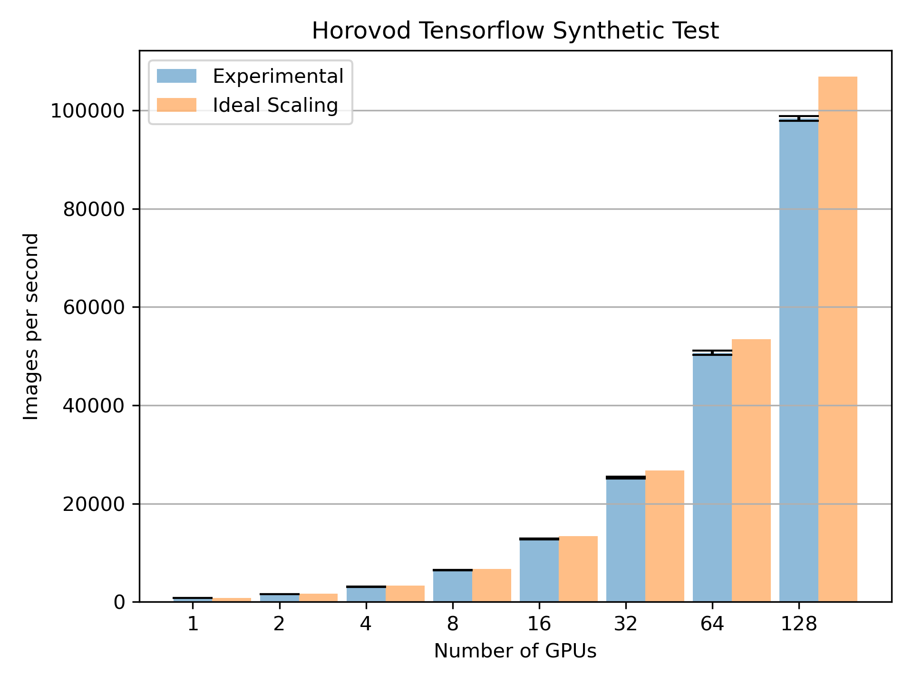

# Setup for TensorFlow + Horovod

## Setup Issues.

I set my `~/.condarc` to the following

```
envs_dirs:
  - $HOME/.conda/envs
pkgs_dirs:
  - $HOME/.conda/pkgs
```

This was to avoid issues where Conda was trying to write to `/hcp/mp/...`, e.g. 
I was getting errors like:

```
Collecting package metadata (repodata.json): failed

NotWritableError: The current user does not have write permissions to a required path.
  path: /hpc/mp/apps/conda/pkgs/cache/47929eba.json
  uid: 506039
  gid: 506039

If you feel that permissions on this path are set incorrectly, you can manually
change them by executing

  $ sudo chown 506039:506039 /hpc/mp/apps/conda/pkgs/cache/47929eba.json

In general, it's not advisable to use 'sudo conda'.
```

Which is probably an artifact of sourcing the Conda install directly. This can probably
be handled properly once we have a module to setup up Conda.


## Testing

The script [tf2_test.sbatch](tf2_test.sbatch) downloads a synthetic test from the 
Horovod github (this should probably be controlled better) and runs with a varying
number of GPUs. Once finished, it will generate a graph of the scaling.

An example of the output can be seen in the [output](output) folder.
In particular, this is an example of the scaling.



### Notes

- The script requests all the resources for the biggest test, so resources may sit
  idle for longer than desired.
- There are MPI / NCCL settings that should probably be set at a system level and
  I'm not sure I actually understand them all
- Horovod tries to use threaded MPI and we have to disable this.
  See https://horovod.readthedocs.io/en/stable/mpi_include.html
- TensorFlow prints lots of useless warnings / messages. I'm not sure
  if there's a good way to suppress those.
- In order for the scaling to look good there needs to be enough work for the 
  communications to be hidden. For this example, that translates into a sufficiently 
  large batch size.
